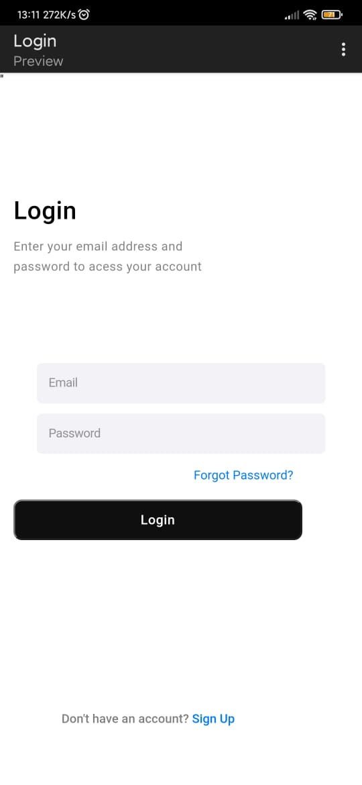

# Login-challenge

  

- [x] Criação HTML
- [x] Estilo em CSS

## 🤝 Colaboradores

Agradecemos às seguintes pessoas que contribuíram para este projeto:

<table>
  <tr>
    <td align="center">
      <a href="#">
         
        
          <b>Ícaro Cristolfe</b>
        
      </a>
  </tr>
</table>

[⬆ Voltar ao topo](#Desafio-HTML) 

